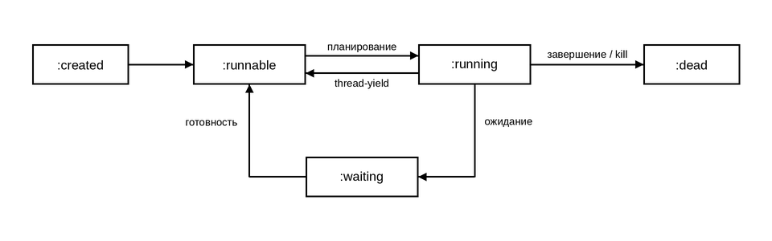

Реализация потоков
===================================================

Жизненный цикл и состояния потока
---------------------------------

Поток может находиться в одном из следующих состояний:

.. list-table::
   :widths: 20 80
   :header-rows: 1

   * - Состояние
     - Описание
   * - ``:created``
     - Поток инициализирован и готов к запуску.
   * - ``:runnable``
     - Поток готов к исполнению и ожидает выделения процессорного времени.
   * - ``:running``
     - Поток непосредственно выполняется процессором.
   * - ``:waiting``
     - Поток заблокирован в ожидании события (таймер или уведомление).
   * - ``:dead``
     - Выполнение функции потока завершено (успешно либо с ошибкой), либо поток был снят через ``thread-kill``.

Схема переходов состояний:

Структуры очередей
------------------

Планировщик использует следующие очереди:

1. **Очередь выполнения (Run Queue)**:
   содержит потоки в состоянии ``:runnable``. Диспетчер извлекает потоки из начала очереди по алгоритму FIFO.

2. **Очереди ожидания (Wait Queues)**:
   каждый примитив синхронизации (мьютекс, условная переменная) содержит отдельную очередь заблокированных потоков. При наступлении события разблокировки поток переносится из очереди ожидания в Run Queue.

Алгоритм цикла планирования
---------------------------

Рабочий поток планировщика циклически выполняет следующие операции:

1. Извлечение первого готового потока из Run Queue.
2. Переключение контекста на выбранный поток.
3. Обработка состояния при возврате управления в планировщик: при вызове ``thread-yield`` поток возвращается в конец Run Queue со статусом ``:runnable``; при блокировке поток переводится в статус ``:waiting`` и добавляется в очередь ожидания; при завершении функции потока ему присваивается статус ``:dead``, фиксируется результат и разблокируются потоки, ожидающие в ``thread-wait``.
4. Если Run Queue пуста: переход в режим ожидания системных событий.